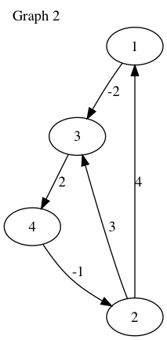
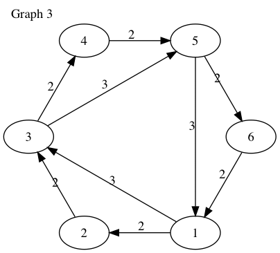
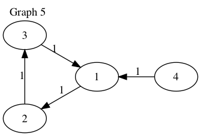

# Floyd-Warshall

### A program implementing the Floyd-Warshall algorithm for computing the quickest route between any two given vertices 

This project uses the Floyd-Warshall algorithm to find the shortest path between two vertices in a weighted graph. It uses both C++ and Python. The Python program interfaces with the compiled C++ library using ``ctypes``. 

## Prerequisites

The makefile uses the g++ compiler to compile the source file to the library and needs to be installed on the user's system. Furthermore an installation of Python is required to run the Python program. 

## Getting Started

Clone this repository and build the library by using using ``make``. Libraries for Mac, Windows and Linux will automatically be built. To only build for one platform you need to run ``make`` with the desired platform. E.G. ``make linux``.

Then simply run the Python program. The Python script will automatically attempt to load the library corresponding to the user's operating system. Several weighted graphs are included and used in included unit tests. The main function in the program is:
```py3
shortestPath(amountOfVertices, weightsArray, fromNode, toNode)
```
The function takes several parameters. The first, ``amountOfVertices`` is the amount of vertices present in the graph to be processed. The second parameter, ``weightsArray`` is a Python list of lists with integers. For example:
```py3
weights = [[1, 2, 3], [1, 4, 1], [1, 3, 3], [3, 4, 1], [4, 3, 1], [4, 2, 1]]
```
is an example of a correct array. Within the inner list are 3 numbers. The first integer corresponds with the vertice where the edge originates. The second integer is the direction of the edge. The last integer is the weight of the edge.
So, ``[1, 2, 3]`` defines an edge from vertex ``1`` to ``2`` with a weight of ``3``.

The parameter ``fromNode`` is the vertex where the route starts, and ``toNode`` is where the path should end. The program then determines if a path between these nodes is possible, and if so, will return the shortest route between the given 2 vertices.


E.G.:
```py3
nodes = 4
weights = [[1, 2, 3], [1, 4, 1], [1, 3, 3], [3, 4, 1], [4, 3, 1], [4, 2, 1]]
print(shortestPath(nodes, weights, 1, 2)) #print quickest path between from 1 to 2 for graph 1
```
Outputs:
```
1 -> 4 -> 2
```

##Graphs
The following graphs are included and used in the unit test. 










## Authors

* Mathijs van Mourick

---

## License

This project is licensed under the MIT License.

Copyright 2018 Mathijs van Mourick

######Permission is hereby granted, free of charge, to any person obtaining a copy of this software and associated documentation files (the "Software"), to deal in the Software without restriction, including without limitation the rights to use, copy, modify, merge, publish, distribute, sublicense, and/or sell copies of the Software, and to permit persons to whom the Software is furnished to do so, subject to the following conditions:

######The above copyright notice and this permission notice shall be included in all copies or substantial portions of the Software.

######THE SOFTWARE IS PROVIDED "AS IS", WITHOUT WARRANTY OF ANY KIND, EXPRESS OR IMPLIED, INCLUDING BUT NOT LIMITED TO THE WARRANTIES OF MERCHANTABILITY, FITNESS FOR A PARTICULAR PURPOSE AND NONINFRINGEMENT. IN NO EVENT SHALL THE AUTHORS OR COPYRIGHT HOLDERS BE LIABLE FOR ANY CLAIM, DAMAGES OR OTHER LIABILITY, WHETHER IN AN ACTION OF CONTRACT, TORT OR OTHERWISE, ARISING FROM, OUT OF OR IN CONNECTION WITH THE SOFTWARE OR THE USE OR OTHER DEALINGS IN THE SOFTWARE.

---